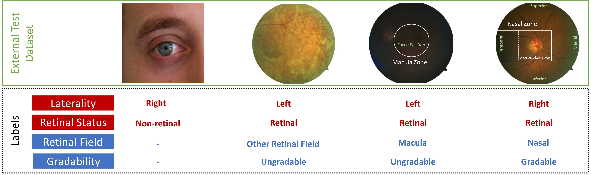

# Automated Image Curation in Diabetic Retinopathy Screening using Deep Learning
This repository contains a Tensorflow 2.7.0 implementation from the paper 
['Nderitu P, *et al*. Automated image curation in diabetic retinopathy screening using deep learning'](https://rdcu.be/cQOe4)

## Key Dependencies
   - Python v3.8.x
   - Tensorflow v2.7.x
   - Sklearn v1.0.x
   - Numpy v1.20.x
   - Matplotlib v3.5.x & Seaborn v0.11.x

## Modules and Resources
*  Class to tune, train and validate a single or multi-output Tensorflow EfficientNet V1-B0 classifier.
*  Class to test and get predictions from a single or multi-output Tensorflow EfficientNet V1-B0 classifier.
*  Ground truth labels for the external validation dataset (*default: ground_truth/external_test_labels.csv*).

## Ground Truth Definitions
Labels for laterality, retinal presence, retinal field and gradability were defined by an ophthalmology fellow.
The figure below shows examples of images and labels from the external test set. External test images are available from
the [Universidad Nacional de Asunción (Paraguay)](https://zenodo.org/record/4891308#.YXgLsp7ML-g) and 
[UBIRIS Periocular (Portugal)](http://iris.di.ubi.pt/ubipr.html) open-access datasets.



## Use
All modes require a csv file. If training or tuning then the supplied csv is assumed to be the 
development dataset and will be randomly split 88/12 into train/val dataset with respect to the PID if provided and 
assumes 20% test set already split for an internal test set at the patient-level.

**If training, tuning or testing, the following columns are required with classes as identified 
define below.**
- Path 
  - *Full path to per sample images*
- Laterality 
  - *Classes*: Right, Left or Unidentifiable
- Retinal_Presence
  - *Classes*: Non-Retinal or Retinal
- Retinal_Field
  - *Classes*: Macula, Nasal or ORF
- Gradability
  - *Classes*: Ungradable or Gradable
- Known_Laterality_Retinal
  - *Classes*: Yes (*per sample indicating retinal images of known laterality*)
  - *Applies to Retinal_Field and Gradability models*
- PID
  - *Optional unique identifier column if multiple samples from the same patient*


**If in predict mode, only the following columns are required with classes as identified define below.**
- Image_ID
  - Unique image identifier
- Laterality
  - *Classes*: Right, Left or Unidentifiable
  - *Applies to Retinal_Field and Gradability models*
- Known_Laterality_Retinal 
  - *Classes*: Yes (*per sample indicating retinal images of known laterality*)
  - *Applies to Retinal_Field and Gradability models*

### Modes
**tune**: Tune mode will load the development csv, split into train/val datasets at 88/12 splits and train a single 
or multi-output model based on the provided label_column +/- aux-column with 20 iterations performed 
(max 3 epochs per iteration), and the hparam space is randomly sampled as follows: 
dropout (0.2, 0.5), learning_rate (1e-4, 1e-2) and regularisation (0.0001, 0.01).

**train**: Training mode will load the csv, split into train/val datasets at 88/12 splits and train a single 
or multi-output model based on the provided label_column +/- aux_column and save the model at each epoch if the 
monitored metric improves (*val_AUC for single-output models, otherwise val_loss*). Note, initially the encoder weights 
(EfficientNet-V1-B0) are frozen until early stop criteria are reached then the whole model is trained.

**test**: Test mode will load the csv and return confusion matrices, ROC and precision-recall curves for the 
label_column +/- aux_column and save the resulting figure.

**predict**: Predict mode will load the csv and return predictions for binary labels or the argmax index for 
multi-class labels saved in the original csv.

### Single-output Model Example
```python main.py -dp ['path to csv'] -ip ['path to images'] -sp ['path to save logs/models/examples/results'] -l ['label column e.g., Laterality'] -mt single-output -m ['mode']```

If performing inference (test or predict modes), ```-mp ['path to the trained model']``` must also be provided.

### Multi-output Model Example
```python main.py -dp ['path to csv'] -ip ['path to images'] -sp ['path to save logs/models/examples/results'] -l ['label column e.g., Laterality']  -al ['second label column e.g., Retinal_Presence'] -mt multi-output -m ['mode']```

If performing inference (test or predict modes), ```-mp ['path to the trained tensorflow model']``` must also be
provided.

#### Other Arguments
- -ucw: If class weights should be used (*single-output models only*) (default: True)
- -bs: Batch size (default: 32)
- -do: Dropout (default: 0.2)
- -lr: Learning rate (default: 0.001)
- -r: Regularisation (default: 0.001)
- -me: Maximum training epochs (default: 50 epochs)
- -ih: Image height (default: 224)
- -iw: Image width (default: 224)

#### Defaults
- *patience: Early stopping patience (default: 3 epochs)*
- *early_stopping: This is performed by default and the val_AUC is monitored for single-output models whilst the 
  val_loss is used for multi-output models*
- *train_val_split: Ratio of development dataset to split into train and val partitions (default: 88/12). 
  Assumes 20% test set already split for an internal test set at the patient-level.*
- *save_examples: Save a batch of image examples for inspection (default:True)*
- *seed: Random seed for splitting development dataset into train/val partitions (default: 7)*

## Funding
This work is wholly funded by Diabetes UK via a 
[Sir George Alberti Research Training Fellowship](https://www.diabetes.org.uk/research/our-research-projects/london/nderitu-ai-retinopathy) grant to Paul Nderitu.

## Citation
If you use this work as part of your project, please cite [Nderitu, P., Nunez do Rio, J.M., Webster, M.L. *et al*. Automated image curation in diabetic retinopathy screening using deep learning. *Sci Rep* **12**, 11196 (2022). https://doi.org/10.1038/s41598-022-15491-1'](https://rdcu.be/cQOe4)

## License
This code is licensed under the [Apache 2.0 License](https://opensource.org/licenses/Apache-2.0)